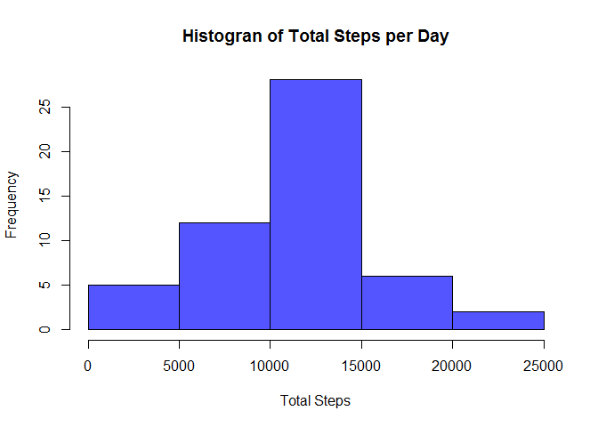
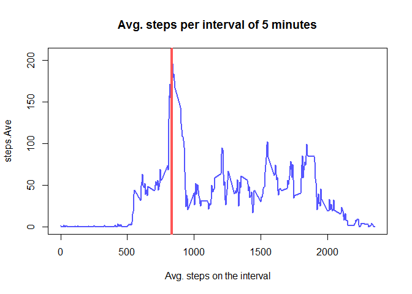

# Reproducible Research: Peer Assessment 1
 

## Loading and preprocessing the data.
The data is on the CSV file activity.csv on the same folder as this file.

```r
library(data.table)
csvraw <- read.table("activity.csv", header=TRUE, sep=",", na.strings = "NA")
csvcompletecases <-data.table(csvraw[complete.cases(csvraw),])
stepsandinterval <- csvcompletecases[,c("steps", "interval")]
```
 

## What is mean total number of steps taken per day?

```r
totalstepsperday <- csvcompletecases[,.(steps.Sum = sum(steps)),by=date];
hist(totalstepsperday$steps, main="Histogran of Total Steps per Day", col="#5555ff", xlab="Total Steps");
```

 

```r
summary(csvcompletecases$steps);
```

```
##    Min. 1st Qu.  Median    Mean 3rd Qu.    Max. 
##    0.00    0.00    0.00   37.38   12.00  806.00
```

## What is the average daily activity pattern?

```r
avgstepsper5min <- csvcompletecases[,.(steps.Ave = ave(steps)),by=interval];
avgstepsper5min <- unique(avgstepsper5min[,list(interval,steps.Ave)]) ;
plot(avgstepsper5min, type = "l", main="Avg. steps per interval of 5 minutes", lwd=2, col="#5555ff", xlab="Avg. steps on the interval");
abline(v=835, col="#ff5555", lwd=4);
```

 
  
Please note that the red line represents which 5-minute interval contains the maximum number of steps

## Imputing missing values
1. Counting the number of NAs

```r
missingrows  <- nrow(csvraw) - nrow(csvcompletecases);
print(missingrows);
```

```
## [1] 2304
```
2. To solve the problem with the NA values. We shoud replace each NA value with the average number of steps on the interval across all other days where there no NA on that specific interval. If the average is stil NA, we can fill with zero. This will imporve our data.


## Are there differences in activity patterns between weekdays and weekends?
